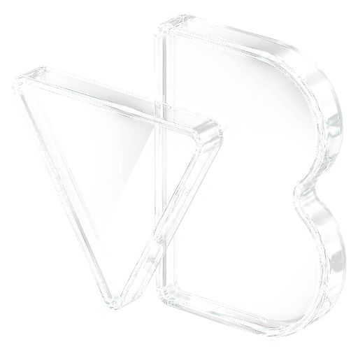
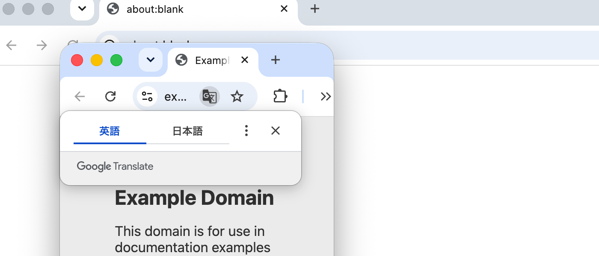

<p align="center">
  
</p>

<h1 align="center">VIEWPORT BREAK</h1>

<p align="center">
  Chrome のウィンドウは <strong>500px</strong> より狭くならない。<br>
  VIEWPORT BREAK はその下限を貫通して、ウィンドウ自体を 375 / 390px にする。
</p>

<p align="center">
  
  
  
  
  
</p>

---

## Chrome のウィンドウは 500px より狭くならない

タブ付きの Chrome ウィンドウには、幅 500px の下限があります。
iPhone 幅の 375 / 390px でレスポンシブを確かめたくても、ウィンドウがそこまで縮みません。
VIEWPORT BREAK はこの壁を越え、375px のウィンドウで実サイトを確認できるようにする Chrome 拡張です。

### 500px はどこで止まっているのか

`chrome.windows.update` も、Chrome DevTools Protocol の `Browser.setWindowBounds` も、500px より狭くはできません。
どちらも Chromium の `Widget::SetBounds()` を通り、`kMainBrowserContentsMinimumWidth = 500` でクランプされるからです
（実測記録は [`docs/WINDOW_FLOOR_2026-08-30.md`](docs/WINDOW_FLOOR_2026-08-30.md)、
拡張単体での再実測は [`docs/EXTENSION_ONLY_LIMITS_2026-08-30.md`](docs/EXTENSION_ONLY_LIMITS_2026-08-30.md)）。

抜け穴は AppleScript の `set bounds` でした。この経路だけは値が NSWindow へ直接渡り、`Widget::SetBounds()` を通りません。
VIEWPORT BREAK は小さな native messaging host を併用して、ここを抜けます。

### DevTools のデバイスエミュレーションとの違い

エミュレーションが差し替えるのはページの描画幅だけで、ウィンドウは元の幅のまま残ります。
VIEWPORT BREAK が動かすのは OS のウィンドウそのもの。375px を要求したときの実測値は、
`outerWidth` も `innerWidth` も 375 でした
（[`docs/evidence/window-floor-2026-08-30/t9_ext.json`](docs/evidence/window-floor-2026-08-30/t9_ext.json)。
320〜1920px の掃引で AppleScript の読み返し・ウィンドウ外形・`innerWidth` の 3 系統が全幅一致した記録は
[`docs/evidence/extension-2026-08-30/sweep_host_widths.json`](docs/evidence/extension-2026-08-30/sweep_host_widths.json)）。

タブもアドレスバーもブックマークバーも DevTools も付いたままです。
拡大率、スクロールバー、フォントレンダリングまで含めて、その幅のウィンドウで実際に起きることがそのまま見えます。

---

## スクリーンショット

320px まで縮めた実際の Chrome ウィンドウです。タブ、アドレスバー、拡張のパズルアイコンがそのまま残っています。
AppleScript で読み返した幅が 320 であることを確認したうえで撮ってあり、生データは
[`docs/evidence/min1px-recovery-2026-08-30/out/shots.json`](docs/evidence/min1px-recovery-2026-08-30/out/shots.json)。



配布用のスクリーンショットはまだ撮っていません。

<!-- TODO: 配布用スクリーンショット（ポップアップの現行 UI / Retina / ダークモード / 実サイト）を撮る。
     docs/evidence/extension-ui-2026-08-30/ の popup 画像は 320 が別枠ボタンだった頃のもので、
     現行のプリセット 12 枠と一致しない。docs/screenshots/ は方式を決める前の PoC 証跡で、
     CDP Emulation.setDeviceMetricsOverride で撮っている。どちらもこの製品の動作写真としては使えない -->

---

## 対応環境

| 項目 | 要件 | 備考 |
|---|---|---|
| OS | macOS 12 以降 | AppleScript（`set bounds`）に依存するため macOS 専用。Windows / Linux は非対応 |
| ブラウザ | Google Chrome 116 以降 | `manifest.json` の `minimum_chrome_version` |
| ブラウザの版 | 標準版 Google Chrome のみ | 1.0.1 以降、native messaging host の登録先を標準版に限定。Brave / Edge / Vivaldi / Arc / Chromium は対象外 |
| ランタイム | DMG 版は追加インストール不要 | 配布版の host は Swift の universal binary で、外部ランタイムに依存しない。リポジトリから直接読み込む開発者向け経路だけは `/usr/bin/python3` を使うため Command Line Tools が要る |
| 権限 | オートメーション権限（初回のみ） | Chrome を制御する許可。これが無いと 500px 未満へは切り替わらない |

---

## インストール

配布形態は 2 つあります。購入者向けは DMG、開発者向けはリポジトリからの直接読み込みです。

### A. DMG（配布物）を使う

`packaging/build_dmg.sh` が生成する `VIEWPORT BREAK <version>.dmg` を使います。
購入者向けの完全な手順は [`packaging/dmg/インストール手順.txt`](packaging/dmg/インストール手順.txt) にあり、
DMG に同梱されるものと同一です。要点だけ書きます。

1. DMG をダブルクリックし、`VIEWPORT BREAK.app` を `Applications` へドラッグする
2. DMG を取り出してから、アプリケーションフォルダのアプリを起動する
3. 「マルウェアが含まれていないことを検証できませんでした」の警告が 2 回出る。
   青いボタンは［ゴミ箱に入れる］なので押さない。［完了］を選び、システム設定の
   「プライバシーとセキュリティ」から［このまま開く］を押す
4. アプリの案内に従って `chrome://extensions` から拡張を読み込む
5. 最初に 500px 未満のプリセットを押したとき、オートメーション権限を［許可］する

警告が出るのは、この版が Developer ID 署名も Apple の公証も通していないからです（ad-hoc 署名のみ）。
壊れているわけではありません。ゼロタッチ配布へ移行する設計は
[`docs/ZERO_TOUCH_INSTALL_DESIGN.md`](docs/ZERO_TOUCH_INSTALL_DESIGN.md) にまとめてあります。

### B. リポジトリから直接読み込む（開発者向け）

まず native messaging host を登録します。何度実行しても同じ結果になります。

```bash
cd extension
./install.sh
```

これで `~/Library/Application Support/Google/Chrome/NativeMessagingHosts/com.nanago.viewport_deck.json`
が置かれます。

次に拡張を読み込みます。

```
chrome://extensions を開く → デベロッパー モードを ON
→「パッケージ化されていない拡張機能を読み込む」→ extension/ を選ぶ
→ ID が ejlimgikbnaihoigbcmelaadniiminfj になっていることを確認する
```

拡張 ID は `manifest.json` の `key` で固定してあります。ディレクトリを移動しても、
host 側の `allowed_origins` は壊れません。

なお、コマンドラインの `--load-extension` は Chrome 151 では黙って無視されます（実測）。
必ず `chrome://extensions` から読み込んでください。

### アンインストール

```bash
cd extension && ./install.sh --uninstall   # host と設定を削除
```

拡張本体は `chrome://extensions` から削除します。

---

## 使い方

ツールバーの VIEWPORT BREAK アイコンをクリックします。

上部に現在のウィンドウ幅が出ます。プリセットは 3 列 × 4 行で、
320 / 360 / 375 / 390 / 414 / 430 / 640 / 768 / 1024 / 1280 / 1440 / 1920 の 12 種類。
押せば即座に切り替わります。

任意の幅も 1〜4000 の範囲で入力できます。AppleScript 経路には技術的な下限が無いので、1px まで本当に縮みます。
高さは変えません。縦の作業領域を勝手に削らないためです。

要求した幅に届かなかったときだけ、その場に理由が出ます。キーボードショートカットからの失敗は
拡張アイコンの赤い `!` バッジにも残り、次に成功したときへ自動で消えます。

プリセットの刻みの根拠（StatCounter 日本のシェアと各機種の CSS viewport 実値）は
[`docs/PRESET_WIDTHS_2026-08-30.md`](docs/PRESET_WIDTHS_2026-08-30.md) にあります。

### キーボードショートカット

| キー | 幅 |
|---|---|
| `⌥⇧1` | 375 |
| `⌥⇧2` | 390 |
| `⌥⇧3` | 768 |
| `⌥⇧4` | 1280 |
| （未割り当て） | 360 |

割り当ては `chrome://extensions/shortcuts` で変えられます。
ポップアップはウィンドウのリサイズで閉じることがあるため、連続で切り替えるならショートカットのほうが速いです。

### CLI

拡張を使わずに同じことができます。host の疎通確認にも使います。

```bash
extension/bin/vw 375          # 現在のウィンドウを 375px 幅に（高さは維持）
extension/bin/vw 390 900      # 幅と高さ
extension/bin/vw --list       # Chrome の全ウィンドウ
extension/bin/vw --get        # 現在の bounds
extension/bin/vw --restore    # 一番狭いウィンドウを 1280px へ戻す
```

---

## ⚠️ 狭くしすぎて操作できなくなったとき

任意幅の下限が 1px なので、ウィンドウ自身からは戻せない状態を作れてしまいます。
そうなったら、まずこれを打ってください。

```bash
extension/bin/vw --restore
```

一番狭い Chrome ウィンドウが 1280px へ戻ります。幅を指定するなら `--restore 900`。

| ウィンドウ幅 | ツールバーに残るもの | ポップアップから戻せるか |
|---|---|---|
| 320px | 拡張のパズルアイコンまで届く | 戻せる |
| 50px | 信号機の赤・黄と戻るボタンだけ。拡張アイコンは消えている | 戻せない |
| 1px | 何も見えない。ウィンドウ枠が縦線 1 本になる | 戻せない |

50px を切る前に、拡張アイコンはもう押せなくなっています。実写は
[`docs/evidence/min1px-recovery-2026-08-30/`](docs/evidence/min1px-recovery-2026-08-30/) に置いてあります。

`vw` を PATH に通しておくと、いざというとき `vw --restore` だけで済みます。

```bash
ln -s "$PWD/extension/bin/vw" /usr/local/bin/vw
```

---

## 仕組み

```
popup / キーボードショートカット
      │  chrome.windows.getCurrent() で対象ウィンドウの bounds を取る
      ▼
core.js ── sendNativeMessage ──▶ viewport_deck_host.py
      │                              │ bounds が一致するウィンドウを AppleScript で特定
      │                              │ set bounds of window id N to {l,t,l+W,t+H}
      │                              ▼ 設定後に読み返した実測値を返す
      │◀─────────────────────────────┘
      ▼
host が使えなければ chrome.windows.update へフォールバック（500px 止まり・UI に明示）
```

対象ウィンドウは、`chrome.windows` の bounds と AppleScript の bounds を突き合わせて特定します
（両者は座標系も単位も一致します）。複数ウィンドウを開いていても誤爆しません。

図はリポジトリから読み込んだときの Python 経路です。DMG 版は同じ設計を Swift の単一バイナリ
（[`packaging/helper/Sources/main.swift`](packaging/helper/Sources/main.swift)）で実装しており、
`osascript` を起動せず `NSAppleScript` で in-process 実行します。オートメーション権限の許可ダイアログに
「python3」ではなく製品名が出るのは、この違いによるものです。

---

## 既知の制限

以下は Chrome と macOS 側の仕様で、拡張側では直せません。

- ウィンドウ枠をドラッグして 500px 以下にはできない。ユーザー操作のリサイズには 500px の下限がそのまま効くので、
  掴んで縮めると戻ってしまう。プリセットを押し直せばよい
- 緑の拡大ボタンを押すと最大化される
- Chrome を再起動すると幅は 500px に戻る。位置と高さは復元されるが、幅だけ戻る
- DevTools は bottom dock か undocked にしておく。right dock だと 375px のうち 225px を DevTools が奪い、
  確認したいコンテンツ幅が残らない
- オートメーション権限が必須。許可しないと host 呼び出しが失敗し、`chrome.windows.update` へ
  フォールバックする（つまり 500px 止まり）。Python 経路では、ダイアログに答えないままだと 15 秒でタイムアウトする
- AppleScript 経路は Chrome の更新で塞がれうる。塞がれれば 500px 未満は到達不能になり、
  そのときは拡張がフォールバックして、500px 止まりであることを UI に出す
- 標準版 Google Chrome 専用。Brave / Edge / Vivaldi / Arc / Chromium には登録しない
- macOS 専用。AppleScript に依存しているため、Windows / Linux への移植経路は無い
- Developer ID 署名と公証をしていないので、初回起動時に Gatekeeper の警告が 2 回出る
- Chrome ウェブストアに公開していない。拡張はデベロッパー モードでの読み込みが前提

---

## リポジトリ構成

```
extension/          Chrome 拡張本体（MV3）と native messaging host
  host/viewport_deck_host.py   AppleScript を叩く本体（CLI としても動く）
  bin/vw                       CLI ショートカット
  install.sh                   host を登録／削除する
packaging/          DMG 配布物のビルド
  build_dmg.sh                 .app と DMG を作る（ad-hoc 署名まで）
  helper/Sources/main.swift    配布版の本体。native messaging host・インストーラ・CLI を兼ねる
  dmg/インストール手順.txt        購入者向けの同梱文書
  tests/test_release_contract.py 配布候補の契約を検証する
assets/brand/       確定ロゴと、そこから派生するアイコン一式の生成
docs/               設計・実測・意思決定の記録（evidence/ に生データ）
tools/              拡張 ID / 鍵まわりの補助スクリプト
```

バージョンの正本は、アプリが `packaging/build_dmg.sh` の `APP_VERSION`、
拡張が `extension/manifest.json` の `version` です。変更履歴は [`CHANGELOG.md`](CHANGELOG.md)。

---

## 名称について

正式な製品名は VIEWPORT BREAK です。根拠は `extension/manifest.json` の `name` と、
`packaging/build_dmg.sh` の `APP_NAME` および `BUNDLE_ID`（`com.nanago.viewport-break`）。

似た名前が 2 つ残っています。`viewport-deck` は元の企画名（ハードウェアデッキ構想）で、
今はローカルのディレクトリ名として残っているだけ。`viewpoint-deck` は企画資料フォルダ名に由来する表記ゆれで、
製品名ではありません。

---

## ライセンス

プロプライエタリです。無断での再配布・改変・再販を禁止します。詳細は [`LICENSE`](LICENSE)。
