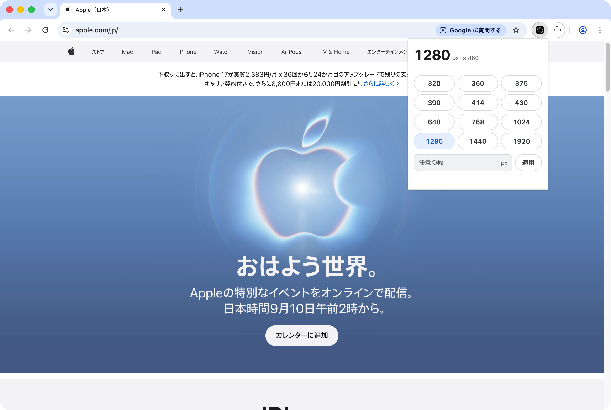
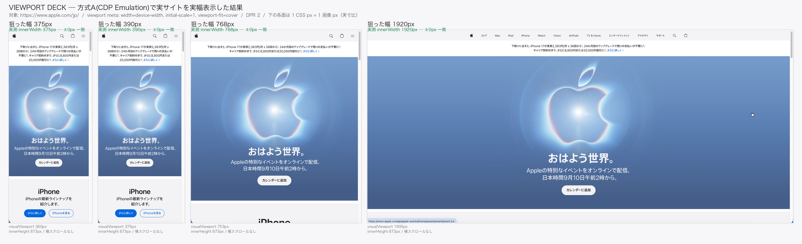

<p align="center">
  
</p>

<h1 align="center">VIEWPORT BREAK</h1>

<p align="center">
  Chrome のウィンドウは <strong>500px</strong> より狭くできない。<br>
  VIEWPORT BREAK は、その下限を強制的に越えて、ウィンドウ自体を 375 / 390px にします。
</p>

<p align="center">
  
  
  
  
  
</p>

---

## Chrome のウィンドウは 500px より狭くできない

コーディングをしていると、デベロッパーツールでは境目をドラッグして表示幅を自由に変えられます。
ところが、Chrome のウィンドウそのものは 500px より狭くできません。
iPhone 幅の 375 / 390px でレスポンシブを確かめたくても、ウィンドウがそこまで縮まないのです。

VIEWPORT BREAK は、この 500px の下限を強制的に越えます。
ボタンを押すと、ページの描画だけでなく Chrome のウィンドウ自体が 375px になります。

### なぜ 500px で止まるのか

Chrome にウィンドウの大きさを変えるよう頼む経路は、拡張機能の API（`chrome.windows.update`）でも
DevTools Protocol（`Browser.setWindowBounds`）でも、500px より狭くはなりません。
どちらも Chromium 内部の同じ処理を通り、`kMainBrowserContentsMinimumWidth = 500` で切り上げられるからです
（実測記録は [`docs/WINDOW_FLOOR_2026-08-30.md`](docs/WINDOW_FLOOR_2026-08-30.md)、
拡張だけで再実測したものは [`docs/EXTENSION_ONLY_LIMITS_2026-08-30.md`](docs/EXTENSION_ONLY_LIMITS_2026-08-30.md)）。

抜け道が 1 つだけありました。macOS の AppleScript でウィンドウの位置とサイズを直接指定する経路です。
ここだけは Chromium 内部の下限処理を通らず、値が macOS のウィンドウへそのまま届きます。
VIEWPORT BREAK は、この経路を叩く小さな常駐プログラム（native messaging host）を拡張と一緒に入れることで、
500px の壁を抜けています。

### DevTools のデバイスエミュレーションとの違い

エミュレーションで変わるのはページの描画幅だけで、ウィンドウは元の幅のまま残ります。
VIEWPORT BREAK が動かすのは macOS のウィンドウそのものです。375px を指定したときの実測値は、
`outerWidth` も `innerWidth` も 375 でした
（[`docs/evidence/window-floor-2026-08-30/t9_ext.json`](docs/evidence/window-floor-2026-08-30/t9_ext.json)。
320〜1920px を通しで試し、AppleScript の読み返し・ウィンドウの外形・`innerWidth` の 3 つがすべての幅で一致した記録は
[`docs/evidence/extension-2026-08-30/sweep_host_widths.json`](docs/evidence/extension-2026-08-30/sweep_host_widths.json)）。

タブもアドレスバーもブックマークバーも DevTools も、付いたまま縮みます。
拡大率、スクロールバー、フォントの見え方まで含めて、その幅のウィンドウで実際に起きることがそのまま見えます。

---

## スクリーンショット

すべて実物の Chrome ウィンドウの写真です。DevTools のデバイスエミュレーションではありません。
幅を変えているのは VIEWPORT BREAK 本体（AppleScript の `set bounds`）で、撮影は対象のウィンドウ 1 枚だけです。
撮り方と実測値は [`docs/screenshots/measurements.json`](docs/screenshots/measurements.json)、
並べて見るなら [`docs/screenshots/index.html`](docs/screenshots/index.html)。

ツールバーのアイコンから開くポップアップです。上に今のウィンドウ幅、下にプリセット 12 個と自由入力欄があります。



同じページを 375 / 390 / 768 / 1920px のウィンドウで開いたものです。並んでいる幅の比が、そのまま実際の表示幅の比です。



---

## 対応環境

| 項目 | 要件 | 備考 |
|---|---|---|
| OS | macOS 12 以降 | AppleScript（`set bounds`）を使うため macOS 専用。Windows / Linux では動きません |
| ブラウザ | Google Chrome 116 以降 | `manifest.json` の `minimum_chrome_version` |
| ブラウザの種類 | 標準の Google Chrome だけ | 1.0.1 以降、常駐プログラムの登録先を標準版に限定。Brave / Edge / Vivaldi / Arc / Chromium では動きません |
| 追加インストール | DMG 版は不要 | 配布版の常駐プログラムは単体で動く Swift 製バイナリ。リポジトリから直接読み込む開発者向けの経路だけ `/usr/bin/python3` を使うため Command Line Tools が要ります |
| 権限 | オートメーション権限（初回だけ） | Chrome を操作する許可。これが無いと 500px 未満へは切り替わりません |

---

## インストール

配布のかたちは 2 つです。購入者向けは DMG、開発者向けはリポジトリからの直接読み込みです。

### A. DMG（配布物）を使う

`packaging/build_dmg.sh` が作る `VIEWPORT BREAK <version>.dmg` を使います。
購入者向けの手順は [`packaging/dmg/インストール手順.txt`](packaging/dmg/インストール手順.txt) にあり、DMG に同梱されるものと同じです。
要点だけ書きます。

1. DMG をダブルクリックし、`VIEWPORT BREAK.app` を `Applications` へドラッグする
2. DMG を取り出してから、アプリケーションフォルダのアプリを起動する
3. 「マルウェアが含まれていないことを検証できませんでした」の警告が 2 回出る。
   青いボタンは［ゴミ箱に入れる］なので押さない。［完了］を選び、システム設定の
   「プライバシーとセキュリティ」から［このまま開く］を押す
4. アプリの案内どおりに `chrome://extensions` から拡張を読み込む
5. 最初に 500px 未満のプリセットを押したとき、オートメーション権限を［許可］する

警告が出るのは、この版が Developer ID 署名も Apple の公証も通していないからです（ad-hoc 署名のみ）。
壊れているわけではありません。警告を出さずに配布するための設計は
[`docs/ZERO_TOUCH_INSTALL_DESIGN.md`](docs/ZERO_TOUCH_INSTALL_DESIGN.md) にまとめてあります。

### B. リポジトリから直接読み込む（開発者向け）

まず常駐プログラム（native messaging host）を登録します。何度実行しても結果は同じです。

```bash
cd extension
./install.sh
```

これで `~/Library/Application Support/Google/Chrome/NativeMessagingHosts/com.nanago.viewport_deck.json`
が置かれます。

次に拡張を読み込みます。

```
chrome://extensions を開く → デベロッパー モードを ON
→「パッケージ化されていない拡張機能を読み込む」→ extension/ を選ぶ
→ ID が ejlimgikbnaihoigbcmelaadniiminfj になっていることを確認する
```

拡張 ID は `manifest.json` の `key` で固定してあるので、ディレクトリを移動しても常駐プログラム側の設定は壊れません。

なお、コマンドラインの `--load-extension` は Chrome 151 / 152 では黙って無視されます（実測）。
必ず `chrome://extensions` から読み込んでください。

### アンインストール

```bash
cd extension && ./install.sh --uninstall   # 常駐プログラムと設定を削除
```

拡張本体は `chrome://extensions` から削除します。

---

## 使い方

ツールバーの VIEWPORT BREAK アイコンをクリックします。

上に今のウィンドウ幅が出ます。プリセットは 3 列 × 4 行で、
320 / 360 / 375 / 390 / 414 / 430 / 640 / 768 / 1024 / 1280 / 1440 / 1920 の 12 種類。
押せばすぐ切り替わります。

好きな幅も 1〜4000 の範囲で入力できます。AppleScript の経路には下限が無いので、1px まで本当に縮みます。
高さは変えません。縦の作業領域を勝手に削らないためです。

指定した幅に届かなかったときだけ、その場に理由が出ます。ショートカットからの失敗は
拡張アイコンの赤い `!` バッジにも残り、次に成功したときに自動で消えます。

プリセットの幅を選んだ理由（StatCounter 日本のシェアと各機種の CSS viewport 実値）は
[`docs/PRESET_WIDTHS_2026-08-30.md`](docs/PRESET_WIDTHS_2026-08-30.md) にあります。

### キーボードショートカット

| キー | 幅 |
|---|---|
| `⌥⇧1` | 375 |
| `⌥⇧2` | 390 |
| `⌥⇧3` | 768 |
| `⌥⇧4` | 1280 |
| （未割り当て） | 360 |

割り当ては `chrome://extensions/shortcuts` で変えられます。
ポップアップはウィンドウのリサイズで閉じることがあるので、続けて切り替えるならショートカットのほうが速いです。

### CLI

拡張を使わずに同じことができます。常駐プログラムがちゃんと動いているかの確認にも使えます。

```bash
extension/bin/vw 375          # 今のウィンドウを 375px 幅に（高さはそのまま）
extension/bin/vw 390 900      # 幅と高さ
extension/bin/vw --list       # Chrome の全ウィンドウ
extension/bin/vw --get        # 今の位置とサイズ
extension/bin/vw --restore    # 一番狭いウィンドウを 1280px へ戻す
```

---

## ⚠️ 狭くしすぎて操作できなくなったとき

自由入力の下限が 1px なので、ウィンドウ自身からは戻せない状態を作れてしまいます。
そうなったら、まずこれを打ってください。

```bash
extension/bin/vw --restore
```

一番狭い Chrome ウィンドウが 1280px へ戻ります。幅を指定するなら `--restore 900`。

| ウィンドウ幅 | ツールバーに残るもの | ポップアップから戻せるか |
|---|---|---|
| 320px | 拡張のパズルアイコンまで見えている | 戻せる |
| 50px | 信号機の赤・黄と戻るボタンだけ。拡張アイコンは消えている | 戻せない |
| 1px | 何も見えない。ウィンドウが縦線 1 本になる | 戻せない |

50px を切る前に、拡張アイコンはもう押せなくなっています。実際の写真は
[`docs/evidence/min1px-recovery-2026-08-30/`](docs/evidence/min1px-recovery-2026-08-30/) にあります。

`vw` を PATH に通しておくと、いざというとき `vw --restore` だけで済みます。

```bash
ln -s "$PWD/extension/bin/vw" /usr/local/bin/vw
```

---

## 仕組み

やっていることは 3 つです。

1. ポップアップかショートカットで幅を指定すると、拡張が今のウィンドウの位置とサイズを調べる
2. それを、一緒に入れておいた常駐プログラム（native messaging host）へ渡す
3. 常駐プログラムが AppleScript でそのウィンドウを名指しし、指定の幅にリサイズして、変更後の実測値を返す

Chrome の API を通さず macOS へ直接リサイズを頼むので、500px の下限が効きません。

```
popup / キーボードショートカット
      │  chrome.windows.getCurrent() で対象ウィンドウの位置とサイズを取る
      ▼
core.js ── sendNativeMessage ──▶ viewport_deck_host.py
      │                              │ 位置とサイズが一致するウィンドウを AppleScript で特定
      │                              │ set bounds of window id N to {l,t,l+W,t+H}
      │                              ▼ 設定後に読み返した実測値を返す
      │◀─────────────────────────────┘
      ▼
常駐プログラムが使えなければ chrome.windows.update へ切り替え（500px 止まり・UI に明示）
```

どのウィンドウを操作するかは、Chrome 側が持っている位置・サイズと AppleScript 側のそれを突き合わせて決めます
（座標系も単位も一致します）。ウィンドウを何枚開いていても、別のウィンドウを掴んでしまうことはありません。

上の図はリポジトリから直接読み込んだときの Python 版の経路です。DMG 版は同じ流れを Swift の 1 バイナリ
（[`packaging/helper/Sources/main.swift`](packaging/helper/Sources/main.swift)）で実装していて、
`osascript` を起動せずアプリの中で AppleScript を実行します。オートメーション権限のダイアログに
「python3」ではなく製品名が出るのは、この違いによるものです。

---

## 既知の制限

以下は Chrome と macOS 側の仕様なので、拡張側では直せません。

- ウィンドウ枠をドラッグして 500px 以下にはできない。手で掴んで縮めると 500px に戻ってしまう。
  プリセットを押し直せば済む
- 緑の拡大ボタンを押すと最大化される
- Chrome を再起動すると幅は 500px に戻る。位置と高さは元どおりになるが、幅だけ戻る
- DevTools は下側に出すか、別ウィンドウにしておく。右側に出すと 375px のうち 225px を DevTools が使ってしまい、
  肝心のコンテンツ幅が残らない
- オートメーション権限が必須。許可しないと常駐プログラムの呼び出しが失敗し、`chrome.windows.update` へ
  切り替わる（つまり 500px 止まり）。Python 版では、ダイアログに答えないままだと 15 秒でタイムアウトする
- AppleScript の経路は Chrome の更新で塞がれる可能性がある。塞がれれば 500px 未満には届かなくなり、
  そのときは拡張が `chrome.windows.update` へ切り替えて、500px 止まりであることを UI に出す
- 標準の Google Chrome 専用。Brave / Edge / Vivaldi / Arc / Chromium には登録しない
- macOS 専用。AppleScript を使っているため、Windows / Linux へ移す方法は無い
- Developer ID 署名と公証をしていないので、初回起動時に Gatekeeper の警告が 2 回出る
- Chrome ウェブストアには公開していない。拡張はデベロッパー モードでの読み込みが前提

---

## リポジトリ構成

```
extension/          Chrome 拡張本体（MV3）と常駐プログラム（native messaging host）
  host/viewport_deck_host.py   AppleScript を叩く本体（CLI としても動く）
  bin/vw                       CLI ショートカット
  install.sh                   常駐プログラムを登録／削除する
packaging/          DMG 配布物のビルド
  build_dmg.sh                 .app と DMG を作る（ad-hoc 署名まで）
  helper/Sources/main.swift    配布版の本体。常駐プログラム・インストーラ・CLI を兼ねる
  dmg/インストール手順.txt        購入者向けの同梱文書
  tests/test_release_contract.py 配布候補の中身を検証する
assets/brand/       確定ロゴと、そこから派生するアイコン一式の生成
docs/               設計・実測・決定の記録（evidence/ に生データ）
tools/              拡張 ID / 鍵まわりの補助スクリプト
```

バージョンの正本は、アプリが `packaging/build_dmg.sh` の `APP_VERSION`、
拡張が `extension/manifest.json` の `version` です。変更履歴は [`CHANGELOG.md`](CHANGELOG.md)。

---

## 名称について

正式な製品名は VIEWPORT BREAK です。根拠は `extension/manifest.json` の `name` と、
`packaging/build_dmg.sh` の `APP_NAME` および `BUNDLE_ID`（`com.nanago.viewport-break`）。

似た名前が 2 つ残っています。`viewport-deck` は元の企画名（ハードウェアデッキ構想）で、
今はローカルのディレクトリ名として残っているだけ。`viewpoint-deck` は企画資料のフォルダ名に由来する表記ゆれで、
製品名ではありません。

---

## ライセンス

プロプライエタリです。無断での再配布・改変・再販を禁止します。詳細は [`LICENSE`](LICENSE)。
