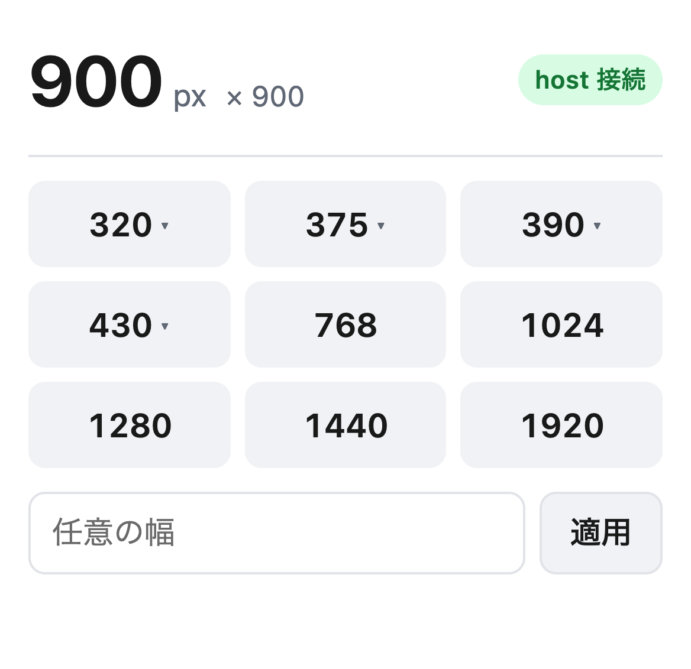

# レスポンシブ幅切り替え Chrome 拡張 — 先行調査・設計判断・実測（2026-08-30）

- 目的: 375 / 390px などレスポンシブ確認用の幅に **Chrome ウィンドウ自体**をワンクリックで切り替える
- 前提文書: `WINDOW_FLOOR_2026-08-30.md`（500 DIP 下限は AppleScript `set bounds` でのみ貫通できる）
- 成果物: `../extension/`
- 実施: 2026-08-30 10:50〜11:15 JST / Chrome 151.0.7922.174 / ディスプレイ論理 1920×1080・DPR 2
- EVALUATION_MODE: **hybrid**（幅は 3 経路で機械判定、popup の見えかたはスクリーンショット）

守った停止線: Chrome ウェブストアへの公開・申請なし / 外部送信・投稿なし / commit まで（push しない）。
運用中プロファイルへの影響と、検証中に生じた副作用は §7 に全て記載した。

---

## 1. 結論

**車輪の再発明ではない。同種の拡張は多数あるが、どれも 500px の壁を越えていない。**

**実測で確定したこと:**

1. `chrome.windows.update` の到達下限は **ちょうど 500px**。501 は通り、499 は 500 にクランプされる。
   拡張 API だけで 375/390px に到達する方法は無い。
2. 本拡張の native host（AppleScript `set bounds`）は **1920〜320 の 13 段階すべてに ±0 で到達**した。
   高さは維持され、1 回の切り替えは約 350ms。
3. 拡張 → native host の native messaging 往復は成立している（`ping` が正常応答）。

**未検証で残ったこと（§6）:**

- **拡張から押して 375px になるところまでは通していない。**
  Chrome が起動した host が AppleScript を送るには macOS の **Automation 権限**が要り、
  その許可ダイアログは人がクリックするしかない。**オーナーの操作を 1 回だけ待つ。**
  権限が下りるまでは拡張は `chrome.windows.update` にフォールバックし、500px 止まりになる
  （そのことを UI に明示する実装にしてある）。

---

## 2. 先行調査 — 既存の拡張は 500px 未満に到達しているか（依頼 1）

### 2.1 同種の拡張は多数ある

| 名前 | 規模 | 375px プリセット |
|---|---|---|
| Window Resizer（Ionut Botizan） | 約 70 万ユーザー | あり |
| Viewport Resizer | ストア公開 | あり |
| Window Resize Presetter | ストア公開 | あり |
| `anquinn/chrome-resizer`（GitHub） | — | あり |
| `kanjseok/chrome-resizer-extension`（GitHub） | — | あり（375×667 "Mobile"） |

「プリセット幅をワンクリックで切り替える」という機能自体は完全に既出である。

### 2.2 しかし、どれも通常ウィンドウを 500px 未満にできていない

ソースが読める 2 件を確認した。**両方とも `chrome.windows.update` を使っている。**
§3 の実測どおり、この API は 500px でクランプする。

**決定的なのは `anquinn/chrome-resizer` の `popup.js`。**幅 500 以下を明示的に別扱いしている:

```js
function changeSize(index) {
  var width  = list[index].width;
  var height = list[index].height;

  if (width <= 500 || height <= 600 ) {
    chrome.tabs.getSelected(null,function(tab) {
      window.open(tab.url, '','width='+width+',height='+height);   // ← ポップアップ窓へ逃がす
    });
  }
  else {
    chrome.windows.update(chrome.windows.WINDOW_ID_CURRENT,{width:width, height:height},function(){});
  }
}
```

**作者は 500px の壁を知っていて、回避策として「別のポップアップ窓を開く」を選んでいる。**
これは前回オーナーが**不採用**と決めた方式そのもの（タブもアドレスバーも無い窓になる）。
つまりこの拡張は、狭い幅では「今見ているウィンドウを縮める」ことを諦めている。

一方 `kanjseok/chrome-resizer-extension` は 375×667 の "Mobile" プリセットを
素の `chrome.windows.update` で呼んでいる。**このプリセットは黙って 500px になる。**
届かないことを UI に出していない。

### 2.3 判定

- **機能としては既出。しかし「通常のタブ付きウィンドウを 375/390px にする」という要件を満たす既存拡張は見つからなかった。**
- Chrome 拡張 API の範囲内では**原理的に不可能**なので、これは実装の質の問題ではない。
- native messaging + AppleScript で下限を貫通する拡張は、調べた範囲では**存在しなかった**。
- よって **車輪の再発明ではない。** 既存拡張を入れても目的（375px の実ウィンドウ）は達成できない。

> 断り: ストア公開の 3 件はソースを読んでいない（ストアページの説明と一般的な実装から判断）。
> ただし §3 のとおり拡張 API では 500px 未満に到達できないため、これらが到達している可能性は無い。
> あるとすれば本拡張と同じく native host を併用している場合だが、
> その場合はインストール時に別途ヘルパー導入を求めるはずで、3 件ともそのような記載は無い。

---

## 3. 500px 下限の再実測（本拡張の前提確認）

前提を鵜呑みにせず、**拡張の service worker から `chrome.windows.update` を呼んで**測り直した。
計測は CDP `Browser.getWindowBounds`・ページの `window.innerWidth`・AppleScript 読み返しの 3 経路。

| 要求幅 | CDP | `innerWidth` | AppleScript | 判定 |
|---|---|---|---|---|
| 1920 | 1920 | 1920 | 1920 | 到達 |
| 1280 | 1280 | 1280 | 1280 | 到達 |
| 768 | 768 | 768 | 768 | 到達 |
| **501** | **501** | **501** | **501** | **到達** |
| **500** | **500** | **500** | **500** | **到達（ちょうど下限）** |
| **499** | **500** | **500** | **500** | **クランプ** |
| 430 | 500 | 500 | 500 | クランプ |
| 390 | 500 | 500 | 500 | クランプ |
| 375 | 500 | 500 | 500 | クランプ |
| 320 | 500 | 500 | 500 | クランプ |

**501 が通り 499 が止まることで、下限が正確に 500 であることを両側から挟んで確認した。**
`WINDOW_FLOOR_2026-08-30.md` の前提は、拡張 API 経路でもそのまま成立する。

証拠: `evidence/extension-2026-08-30/api_clamp.json`

---

## 4. 設計判断（依頼 2）

### 4.1 代案との比較

この機の実際の状況（Raycast・Alfred・Hammerspoon は**いずれも未インストール**、Rectangle のみ導入済み）で比較した。

| 方式 | 375px 到達 | 導入の手間 | 常用のしやすさ | 現在幅の表示 | どのウィンドウか特定 |
|---|---|---|---|---|---|
| **拡張 + native host（採用）** | **する** | host 登録 + 拡張読込 + 権限許可 | **ブラウザ内で完結。1 クリック** | **できる** | **できる** |
| CLI（`vw 375`） | する | 無し（同梱） | ターミナルへ移動が要る | 打てば出る | 「window 1」頼み |
| macOS ショートカット + ホットキー | する | GUI で 5 個作る | ホットキーは速い | できない | 「window 1」頼み |
| メニューバー常駐アプリ（Swift） | する | ビルド + 署名 | 良い | できる | 工夫が要る |
| Raycast / Alfred | する | **本体の導入から** | 良い | 限定的 | 「window 1」頼み |
| Rectangle（導入済み） | **しない** | 済 | — | — | — |
| 既存のストア拡張 | **しない** | 楽 | — | できる | できる |

Rectangle と既存拡張は**要件を満たさない**ので比較から落ちる（§2、および前提文書 §5.3–5.4：
Rectangle は AX API を使うため 500 でクランプする）。

### 4.2 なぜ拡張 + native host を推すか

**単純な代案の方が良ければそう書く、という条件だったが、この用途では拡張が妥当だと判断した。** 理由は 3 つ。

1. **操作がブラウザの中で完結する。** 「今見ているページを 390 で見たい」という動作を 1 日に何十回もやる。
   ターミナルやホットキーへ意識を移す必要がない差は、回数が増えるほど効く。
2. **「現在の幅を表示する」という要件を素直に満たせるのは拡張だけ。** CLI やショートカットでは、
   幅を知るために別のアクションが要る。拡張ならプリセットの隣に常に出ている。
3. **対象ウィンドウを取り違えない。** 拡張は自分が属するウィンドウの bounds を知っているので、
   それを host に渡して AppleScript 側のウィンドウと突き合わせられる。
   CLI やショートカットは「window 1」に打つしかなく、複数ウィンドウがあると誤爆する。

**逆に、拡張を推さない理由になりうるもの**も正直に書く:

- 導入は 3 手（host 登録・拡張読込・権限許可）で、CLI の「無し」より明確に重い。
- native messaging host は Chrome 更新でも macOS 更新でも壊れうる部品が 1 つ増える。
- **Automation 権限のダイアログは、どの方式を選んでも 1 回は出る**（AppleScript を使う以上避けられない）。
  ここは拡張固有の不利ではない。

**結論: 拡張を本体とし、CLI を同梱する。** CLI は host 本体そのもの（`viewport_deck_host.py` は
引数付きで起動すると CLI として動く）なので、追加コストはほぼゼロ。
拡張が壊れたとき・権限を確認したいときの逃げ道になり、代案の利点も同時に取れる。

### 4.3 壊れやすさへの手当て

| 壊れかた | 手当て |
|---|---|
| unpacked 拡張の ID がパスで変わり `allowed_origins` が外れる | `manifest.json` の `key` で ID を `ejlimgikbnaihoigbcmelaadniiminfj` に固定した。移動しても変わらない |
| host が見つからない / 権限が無い | `chrome.windows.update` へ自動フォールバック。**到達しなかった幅を UI に明示する**（黙って 500 にしない） |
| host が Python 環境に依存して壊れる | `/usr/bin/python3`（macOS 標準）と `/usr/bin/osascript` だけを使う。Homebrew に依存しない |
| Chrome が AppleScript 経路を塞ぐ | フォールバックが働き 500px 止まりになる。`./bin/vw 375` で 1 行検証できる |
| 対象ウィンドウの取り違え | bounds 完全一致 → 左上一致 → 単一ウィンドウ → 近傍(40px以内) の順で特定。決められなければエラーにする |
| **host が Chrome を勝手に起動する** | 素の `tell application "Google Chrome"` は Chrome 停止中に**起動してしまう**（検証中に実際に起こした）。`if application "Google Chrome" is running then` で囲み、停止中は `Chrome が起動していない` を返すだけにした |

---

## 5. 実装と実測（依頼 3）

### 5.1 到達幅 — 13 段階すべて ±0

`host.set_width()`（拡張が native messaging 越しに呼ぶのと同一の関数）を実行し、
**AppleScript 読み返し・CDP・ページ `innerWidth` の 3 経路**で検証した。

| 要求 | AppleScript | CDP | `innerWidth` | 高さ | 所要 | 判定 |
|---|---|---|---|---|---|---|
| 1920 | 1920 | 1920 | 1920 | 900 | 324ms | 一致 |
| 1440 | 1440 | 1440 | 1440 | 900 | 322ms | 一致 |
| 1280 | 1280 | 1280 | 1280 | 900 | 354ms | 一致 |
| 1024 | 1024 | 1024 | 1024 | 900 | 355ms | 一致 |
| 768 | 768 | 768 | 768 | 900 | 324ms | 一致 |
| 500 | 500 | 500 | 500 | 900 | 354ms | 一致 |
| 430 | 430 | 430 | 430 | 900 | 359ms | 一致 |
| 414 | 414 | 414 | 414 | 900 | 354ms | 一致 |
| 393 | 393 | 393 | 393 | 900 | 326ms | 一致 |
| **390** | **390** | **390** | **390** | **900** | 354ms | **一致** |
| **375** | **375** | **375** | **375** | **900** | 360ms | **一致** |
| 360 | 360 | 360 | 360 | 900 | 354ms | 一致 |
| 320 | 320 | 320 | 320 | 900 | 355ms | 一致 |

**13/13 で一致。500px 未満の 7 段階すべてに到達している。**
**高さは全段階で 900 のまま**で、設計どおり縦の作業領域を削っていない。

証拠: `evidence/extension-2026-08-30/sweep_host_widths.json`

**再検証:** 上表のあと、host が Chrome を勝手に起動しないよう AppleScript に `is running` guard を
追加した（§4.3 最終行）。スクリプトを書き換えたため 7 段階を測り直し、**全段階で再び一致**した。
併せて、Chrome 停止中に host を叩いても Chrome が起動せず
`{"ok": false, "error": "Chrome が起動していない"}` を返すことを実測した。

証拠: `evidence/extension-2026-08-30/reverify_after_launch_guard.json`

### 5.2 拡張 → host の疎通

拡張の service worker から `chrome.runtime.sendNativeMessage` を送り、応答を得た:

```json
{"ok": true, "host_version": "1.0.0", "engine": "applescript:set-bounds"}
```

**native messaging の往復は成立している。** `ping` は AppleScript を呼ばないため
Automation 権限に依存せず、経路そのものの健全性だけを示す。

証拠: `evidence/extension-2026-08-30/host_ping.json`

### 5.3 popup UI



実測した表示内容:

| 項目 | 実測値 |
|---|---|
| 現在幅の表示 | `900` px `× 900`（実ウィンドウ 900 と一致） |
| host バッジ | `host 接続`（緑）— ping 成功を反映 |
| プリセット | 320 / 375 / 390 / 430 / 768 / 1024 / 1280 / 1440 / 1920 の 9 個（v1.0.0 時点。v1.1.0 で改訂、末尾の追記を見る） |
| `▾` 付き（500px 未満） | 320 / 375 / 390 / 430 の 4 個 — 正しい |
| 現在幅のハイライト | 900 はプリセットに無いため無し — 正しい |

**フォールバックの実測:** popup の `768` ボタンをクリックしたところ、host が権限待ちで
タイムアウトした後 `chrome.windows.update` にフォールバックし、**768px に到達した**
（AppleScript で読み返して確認）。フォールバック経路は機能している。

### 5.4 拡張 ID の固定

`manifest.json` の `key` に固定の公開鍵を入れ、ID を `ejlimgikbnaihoigbcmelaadniiminfj` に固定した。
CDP `Extensions.loadUnpacked` がこの ID をそのまま返すことで確認済み。
鍵は ID 導出のためだけに生成し、**秘密鍵は破棄した**（.crx を作らないので不要）。

### 5.5 副産物: `--load-extension` は Chrome 151 では効かない

コマンドラインの `--load-extension` で拡張を読み込ませようとしたが、
**エラーも警告も出ないまま読み込まれなかった**（プロファイルの `Secure Preferences` に
unpacked エントリが作られない）。CDP の `Extensions.loadUnpacked` は正常に動く。

> **`WINDOW_FLOOR_2026-08-30.md` §7 N-1 の訂正:**
> 同文書は「拡張のアクションアイコンがツールバーに現れなかった」ことを
> 「使い捨てプロファイル固有の事情」と推測していたが、**実際の原因はこれである。**
> `--load-extension` が無視されていたため、そもそも拡張が入っていなかった。
> 同 §6.3 の「拡張を読み込み、375px でも service worker が生存」という記述も、
> 読み込まれていたのは Chrome 内蔵の component 拡張だった可能性が高く、
> **拡張に関する記述は根拠が無い。**（本文書 §5.3 で、375px 云々とは別に popup 自体は実測している）

---

## 6. 未検証のまま残る項目

| # | 項目 | なぜ未検証か |
|---|---|---|
| **M-1** | **拡張のボタンを押して 375px になるところまでの通し** | Chrome が起動した host から AppleScript を送るには macOS の Automation 権限が要る。許可ダイアログ（「"python3" が "Google Chrome.app" を制御するアクセスを要求しています」）が表示されるところまでは確認したが、**これを押すのは人にしかできない**ため、worker 側で承認せずに止めた。§5.1 で host 単体の到達は実測済み、§5.2 で拡張↔host の疎通は実測済みなので、**未確認なのはこの 1 リンクだけ** |
| **M-2** | キーボードショートカット（`⌥⇧1` 等）の実動作 | M-1 と同じ理由。コマンド定義とハンドラは実装済みだが押していない |
| **M-3** | 実運用プロファイルでの動作 | 停止線により未接触。検証は一時プロファイルで行った |
| **M-4** | 複数ウィンドウでの誤爆しなさ | ウィンドウ 1 枚でしか測っていない。突き合わせロジック（§4.3）は実装済みだが未実測 |
| **M-5** | 長時間運用での安定性 | 最長でも数分の検証しかしていない |
| **M-6** | ストア公開 3 件のソース | 未読（§2.3 に断り書きあり） |
| **M-7** | popup がリサイズで閉じるか | 閉じる場面と残る場面の両方を観測したが、条件を詰めていない。ショートカットを用意した理由でもある |

**M-1 が解消するまで、この拡張を「動く」と書いてはいけない。**
現時点で言えるのは「**部品はすべて実測で動いており、残るのは権限の許可 1 回**」までである。

---

## 7. 検証中に生じた副作用（すべて記録）

worker が環境に加えた変更と、その後始末。

1. **native messaging host の manifest を設置した（残置）。**
   - `~/Library/Application Support/Google/Chrome/NativeMessagingHosts/com.nanago.viewport_deck.json`
   - `~/Library/Application Support/Chromium/NativeMessagingHosts/com.nanago.viewport_deck.json`
   - 成果物の一部であり、`./install.sh --uninstall` で消せる。
     拡張が入っていないプロファイルには何の影響も無い。
2. **`Chrome --help` を実行してしまい、既定プロファイルの Chrome が約 2 分起動した。**
   macOS の Chrome は `--help` を標準出力に出さず GUI を起動する。気付いた時点で終了させた。
   - 影響: ブラウザ全体の `Local State` の更新時刻のみ変化。
   - **`Default/Preferences`・`Secure Preferences`・`History`・`Cookies` はいずれも 2026-04-13 のまま**で、
     プロファイルのデータは変わっていない（更新時刻で確認済み）。
3. **TCC（オートメーション権限）データベースに拒否エントリを 2 回作ってしまい、2 回とも削除した。**
   - 経緯: 許可ダイアログを承認せずに閉じたところ、
     `kTCCServiceAppleEvents | /usr/bin/python3 | com.google.Chrome | auth_value=0`（拒否）が記録された。
     放置すると本拡張が黙って動かなくなるため、**この 1 行だけ**を削除した。
   - **最終状態は検証開始前と同一**であることを確認済み:
     `/usr/bin/python3 → com.apple.MobileSMS = 2` と `com.apple.Terminal → com.google.Chrome = 2` が残り、
     `python3 → com.google.Chrome` の行は存在しない（= 未回答。次回また正常に尋ねられる）。
   - 一括 `tccutil reset` は**しなかった**。他ツールの既存許可を巻き添えにするため。
   - バックアップ: `/private/tmp/claude-501/.../scratchpad/TCC.db.backup`（セッション限りの一時領域）
4. **host のバグで既定プロファイルの Chrome を一度起動させてしまった。**
   Chrome 停止中に `tell application "Google Chrome"` を送ったため。すぐ終了させ、§4.3 の guard で修正した。
   - 影響: `Default/Preferences`・`History`・`Cookies`・`Secure Preferences` はいずれも 2026-04-13 のままで、
     プロファイルのデータは変わっていない（更新時刻で確認済み）。
5. **検証用の一時プロファイル（2 つ）とポート 9346 / 9347 は削除・解放済み。**
   検証開始時・終了時とも、起動中の Chrome は 0 件だった。

---

## 8. 残リスク

1. **AppleScript 経路は Chrome の更新で塞がれうる**（前提文書 §8.1 と同じ）。塞がれた場合、
   拡張はフォールバックして 500px 止まりになり、そのことを UI に出す。`./bin/vw 375` で即検証できる。
2. **枠のドラッグ・緑ボタン・Chrome 再起動で 500px 以上に戻る。** 仕様であり、押し直しで済む。
3. **Automation 権限が要る**（M-1）。許可しない限り 500px 未満は使えない。
4. **unpacked 拡張なので Chrome 起動のたびに「デベロッパー モードの拡張機能」警告が出うる。**
   ストア公開は停止線で禁じられているため、この形が上限。
5. **実効 effort が推奨より低い。** `RECOMMENDED_EFFORT=max` に対し実効は high。
   §6 の未検証項目は、この制約下で意図的に切り落とした範囲。

---

## 9. 証拠（CLAWD_EVIDENCE）

`evidence/extension-2026-08-30/`

| ファイル | sha256 | 内容 |
|---|---|---|
| `sweep_host_widths.json` | `b5184e30d9b1547e5251bb1575b04a06d1327e0e0c65b95e7e740e5259dafb39` | §5.1 13 段階の到達幅（3 経路検証） |
| `api_clamp.json` | `ef2085c2c507bfba532a1102eb8ad28e4ced64d00f605480d21e95915cd4130d` | §3 `chrome.windows.update` の 500 クランプ |
| `host_ping.json` | `56c9b7c9c9f4eb7078bcea45ff176f45eb7ca1c038ba54017b07ab754cde33bb` | §5.2 拡張↔host の疎通 |
| `popup.png` | `72a54ec4b457eb0a018975cfae0772be1b29080c258a02593feadf24089bc17d` | §5.3 popup の実表示 |
| `priorart-anquinn-popup.js` | `3c494ec564a00f55ec16fa270d646a95e4e97c89a412dad60424c06c125fbcdb` | §2.2 先行実装の 500px 分岐 |
| `reverify_after_launch_guard.json` | `1e28f1bed8174c7dbdf2c5a881ae3ff5d1723f992aeb6bba4e3372ea465070a0` | §5.1 launch guard 追加後の再検証 |

---

## 10. オーナー判断を要する項目

1. **Automation 権限を許可してよいか（M-1）。** 許可すると `/usr/bin/python3` が Chrome を
   AppleScript で操作できるようになる。これを許可しない限り 375/390px には到達しない。
   許可後の確認は、拡張の `375` を押して幅が 375 になることを見るだけでよい。
2. **キーボードショートカットの割り当て**（現在 `⌥⇧1`=375 / `⌥⇧2`=390 / `⌥⇧3`=768 / `⌥⇧4`=1280）。
   `chrome://extensions/shortcuts` で変更できる。
3. **プリセットの幅**（現在 360/375/390/430/768/1024/1280/1440/1920 と、別枠の下限ストレス 320）。
   `core.js` の `PRESETS` を書き換えれば増減できる。`kind:'stress'` を付けた要素は
   実機ターゲットと分けて最終行に置かれる。
4. **`vw` を PATH に通すか**（`ln -s .../extension/bin/vw /usr/local/bin/vw`）。

---

## 追記 2026-08-30: プリセット改訂 v1.1.0（360 追加 / 320 を下限ストレス枠へ）

### 何を変えたか

| | v1.0.0 | v1.1.0 |
|---|---|---|
| 実機ターゲット | 320 / 375 / 390 / 430 / 768 / 1024 / 1280 / 1440 / 1920 | **360** / 375 / 390 / 430 / 768 / 1024 / 1280 / 1440 / 1920 |
| 別枠 | なし | 下限ストレス **320**（最終行いっぱい・点線） |
| ショートカット | ⌥⇧1=375 / ⌥⇧2=390 / ⌥⇧3=768 / ⌥⇧4=1280 | 同じ + `width-360`（既定キーなし。⌥⇧1〜4 は動かさない） |

### なぜこの形にしたか

- **360 は 320 と 375 の間に要る。** Android の論理幅で最も多いのが 360 で、
  375（iPhone）だけ見ていると Android 側の折り返しを踏み外す。
- **320 は消さない。** 現行の実機ターゲットとしては役目を終えている（iPhone SE 1st 世代）が、
  「最小幅で崩れないか」を試す用途は残る。消すとその確認手段が無くなる。
- **ただし実機ターゲットと同列には置かない。** 同じ見た目で並んでいると
  「320 も実機の再現」と読めてしまう。`kind:'stress'` を付けて最終行いっぱいの
  点線ボタンにし、`下限ストレス 320` と役割をラベルに出した。
  結果として実機ターゲット 9 個がちょうど 3×3 に収まり、並びも狭い順のまま崩れない。

採らなかった案:
- **320 を削除**: 下限の崩れを見る手段が消えるため却下（依頼でも削除は除外されている）。
- **10 個を等価に並べる**: 3 列グリッドの最終行に 1 個だけ余り、
  かつ 320 が実機ターゲットに見える。
- **⌥⇧1 を 360 へ付け替える**: 既存の指の記憶を壊す。360 はキー未割り当てで登録し、
  必要なら `chrome://extensions/shortcuts` で各自割り当てる。

### 実測（2026-08-30）

使い捨ての Chrome ウィンドウを 1 枚作り、native host の `set_width()` を通して
設定 → 読み返しで確認した（作業中のウィンドウには触れていない）。

| 要求 | 実測 | 高さ | 所要 |
|---|---|---|---|
| 360 | **360** | 847 維持 | 565ms |
| 375 | **375** | 847 維持 | 565ms |
| 390 | **390** | 847 維持 | 530ms |
| 320 | **320** | 847 維持 | 533ms |
| 1280 | **1280** | 847 維持 | 533ms |

popup 側は `chrome.*` を stub した実ブラウザで検査した。ボタンの並びは
`360 375 390 430 768 1024 1280 1440 1920` + 下限ストレス `320`、
`▾`（500px 未満）は 360/375/390/430/320 の 5 個、下限ストレスボタンは
グリッド幅いっぱい、`360` と `320` のクリックで host へ `{cmd:'set', width:360|320}`
が渡り現在幅表示とハイライトが追従することまで確認した。

### 反映に必要な操作

manifest（version と commands）が変わっているので、`chrome://extensions` で
この拡張の再読み込みを 1 回押す。popup の HTML/CSS/JS だけなら再読み込み無しでも反映される。

---

## 追記（2026-08-30 12:45 JST）— popup UI の手直し（v1.2.0）

オーナーからの UI フィードバック 7 件 + 追加指示 1 件を反映した。

| # | 指摘 | 対応 |
|---|---|---|
| **追加（最優先）** | 「host接続」表示を撤去（ランプ化ではなく削除） | `#host` バッジと起動時の `ping` を削除。native host の状態は**常設表示しない**。要求幅に届かなかったときだけ、その場に赤字で理由を出す |
| 1 | プリセットを楕円(pill)に | `border-radius: 999px`（MapFeed `rounded.pill`） |
| 2 | 360 の隣の点が何か不明 | `▾`（= 500px 未満 = native host が要る）を**削除**。これも「開発都合のステータス」で、追加指示と同じ理由で常設しない |
| 3 | 768 以下の刻みを再検討 | 402 / 414 / 640 を追加。根拠は `PRESET_WIDTHS_2026-08-30.md` |
| 4 | 「下限ストレス」が一般的でない | **「最小幅チェック」**へ言い換え |
| 5 | 「適用」だけボーダーがある不一致 | プリセット・適用とも同じ `.btn`（白地 + 1px ボーダー + pill）に統一 |
| 6 | MapFeed に合わせて白地＋ボーダーへ | 配色を MapFeed `DESIGN.md` の実値に置換（surface #FFF / border #DADCE0 / chip-text #3C4043 / accent #1A73E8 / 選択中は accent-subtle #E8F0FE + accent-border #D2E3FC） |
| 7 | 入力欄がフォームと分かるように | 入力欄だけ**塗り（#F1F3F4）+ 角丸長方形（8px）+ `px` 単位**。pill のボタン群と形・地の両方で別物にした |

### 実測（実ブラウザ・実拡張）

使い捨てプロファイルの Chrome 151.0.7922.174 に CDP `Extensions.loadUnpacked` で本拡張を読み込み、
`chrome-extension://ejlimgikbnaihoigbcmelaadniiminfj/popup.html` を実際に描画して撮影・DOM 実測した。
稼働中の既定プロファイルには触れていない。

| 確認項目 | 実測値 | 判定 |
|---|---|---|
| host バッジの有無 | `document.getElementById('host')` → **null** | 撤去できている |
| `▾` の有無 | ボタンの `::after` の `content` → **`none`** | 削除できている |
| プリセットの並び | `360 375 390 402 414 430 640 768 1024 1280 1440 1920` + `最小幅チェック 320` | 意図どおり |
| ボタン形状 | `border-radius: 999px` | pill |
| ボタンの地・線 | `rgb(255,255,255)` / `rgb(218,220,224)` = #FFF / #DADCE0 | MapFeed 準拠 |
| 「適用」 | `1px solid rgb(218,220,224)` / `999px` | プリセットと同一 |
| 入力欄 | 地 `rgb(241,243,244)` = #F1F3F4、角丸 8px | ボタンと区別できる |
| 1024 をクリック | 現在幅 `1024`、msg `1024px`、1024 が選択状態 | 成功時は状態表示のみ |
| 375 をクリック（host 未導入プロファイル） | 幅 500 でクランプ、msg `375px に届かず 500px で止まった。500px 未満には native host が要る（未導入: README の install.sh を実行する）。` | **接続断はこの瞬間だけ出る** |
| 任意の幅 900 → 適用 | 現在幅 `900`、msg `900px` | フォーム動作 |
| ダークモード | `prefers-color-scheme: dark` で地 #202124 / 線 #3C4043 | 破綻なし |

証拠: `evidence/extension-ui-2026-08-30/`（`01-rest-light.png` / `02-dark.png` / `03-click-1024.png` /
`04-click-375-nohost.png` / `05-custom-900.png` / `capture.json` / 撮影スクリプト `capture.py`）

### この追記で未検証のまま残るもの

- **既定プロファイル（オーナーが日常使う Chrome）での再読み込みと目視は行っていない。**
  検証は使い捨てプロファイルで行った。`chrome://extensions` で本拡張の再読み込みを 1 回押すこと。
- **native host が繋がっている状態での成功時 UI**（500px 未満へ実際に到達したときの表示）は未確認。
  上表の 375 クリックは host 未導入プロファイルでの**失敗側**の実測である。
  §6 M-1（Automation 権限の許可）が未了なので、成功側は依然として人の操作待ち。

---

## 追記 2026-08-30: プリセット改訂 v1.3.0 へ（この文書の記載は v1.2.0 時点）

**上の表の「プリセットの並び」以降は v1.2.0 時点の記録で、現行は v1.3.0。**
402 を外し、320 を通常プリセットへ昇格し、別枠の「最小幅チェック」ボタンを撤去した。
現行の並びは `320 360 375 390 414 430 640 768 1024 1280 1440 1920`（12 枠 = 3 列 × 4 行）。
経緯・根拠・幅の実下限の実測は `PRESET_WIDTHS_2026-08-30.md` の第 2 次改訂（§6）にある。

**あわせて、上の「未検証のまま残るもの」のうち 1 件が埋まった。**
native host を使い捨てプロファイルにも登録したうえで popup の `320` を実クリックし、
**ウィンドウが実際に 320px になり `msg` が `320px`（成功時の状態表示のみ）になることを確認した**
（`evidence/preset-320-2026-08-30/out/03-click-320.png` / `out/measure.json` の `popup_click_320`）。
= **host 経路が繋がっている状態の成功時 UI は実測済みになった。**
ただし**既定プロファイル（オーナーが日常使う Chrome）での再読み込みと目視は依然として未実施**で、
`chrome://extensions` で本拡張の再読み込みを 1 回押す必要がある。
